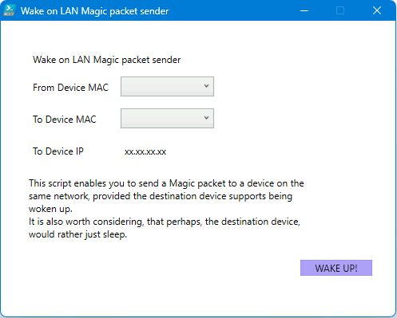

## WakeMeUp

*Powershell skript odesílajíc magický packet*

Měl to být původně takový více fancy ekvivalent toho, jak probouzím svůj druhý notebook z linuxu - následujícím:

```bash
sudo mausezahn enp2s0 "<syrový hex řetězec>" -c 5
```

Myší zoubek, je mimochodem vynikající program. Doporučuji prozkoumat - https://web.archive.org/web/20170830052159/http://www.perihel.at/sec/mz/index.html.

Bohužel, nedostatkem skriptu je, že odesílaný packet není rozeznán Wiresharkem jako ethtype WoL. Je tomu tak z důvodu, že i přes použití syorvého socketu je přidána vlastní IP hlavička. Není to však bránící ve funkčnosti, jelikož při probouzení zařízení naslouchá pro synchronizační stream následován 16x zopakovanou svou MAC adresou. 

### Magický packet

Pro probuzení zařízení je odeslán magický packet - rámec obsahující zdrojovou a cílovou adresu. Cílová adresa může být cílového zařízení, nebo multicast/broadcast. Datový obsah paketu musí kdekoliv uvnitř (ale většinou zde jiný obsah není) obsahovat synhronizační stream - 6 bytů o hodnotě FF. Následovaný 16 krát zopakovanou MAC adresou cílového zařízení (bez oddělovače).

## Užití 

Z důvodu přístupu k síťovým informacím / tvorbě socketu, je nutné spouštět skript z administrátorského okna PowerShellu.

Jelikož je skript nepodepsaný, před spuštěním je nutné nastavit vhodnou `ExecutionPolicy` pomocí:

```powershell
Set-ExecutionPolicy -Scope Process -ExecutionPolicy Bypass			
```

Následně stačí už jen skript spustit.

```powershell
PS C:\Users\Administrator\WoL> .\script.ps1
```

Zobrazí se WPF okno. 



To obsahuje dva ComboBoxy, které umožňují vybrat z jakého rozhraní na jakou MAC adresu se packet pošle. Tyto údaje jsou brány přímo ze systémových údajů - řeší to oklikou validaci vstupu.

Takže pak již jen stačí vybrat, z jakého rozhraní chcete packet odesílat a kam.

```powershell
$NICDevices = Get-NetAdapter | Where-Object {$_.Status -eq "Up"} 
$IfID = $NICDevices.ifIndex
$LANDevices = Get-NetNeighbor -AddressFamily IPv4 -State Reachable -ifIndex $IfID
...
# Add devices MACs to ComboBox dropdown
$NICDevices.MacAddress | ForEach-Object {[void] $FromMAC.Items.Add($_)}

$LANDevices.LinkLayerAddress | ForEach-Object {[void] $ToMAC.Items.Add($_)}
...
# On ComboBox dropdown selection change, update relevant values
$FromMAC.Add_SelectionChanged{ $IfID = $NICDevices[$FromMAC.SelectedIndex].ifIndex
                               # Format the given MAC addresses
                               $Script:SrcMAC = $($FromMAC.SelectedValue -split "-" | ForEach-Object {[Byte]"0x$_"})
}

$ToMAC.Add_SelectionChanged{ $ToIp.Content = $LANDevices[$ToMAC.SelectedIndex].IPAddress
                             # Format the given MAC addresses
                             $Script:DstMAC = $($ToMAC.SelectedValue -split "-" | ForEach-Object {
            [System.Convert]::ToByte($_, 16)
          })
}
```
